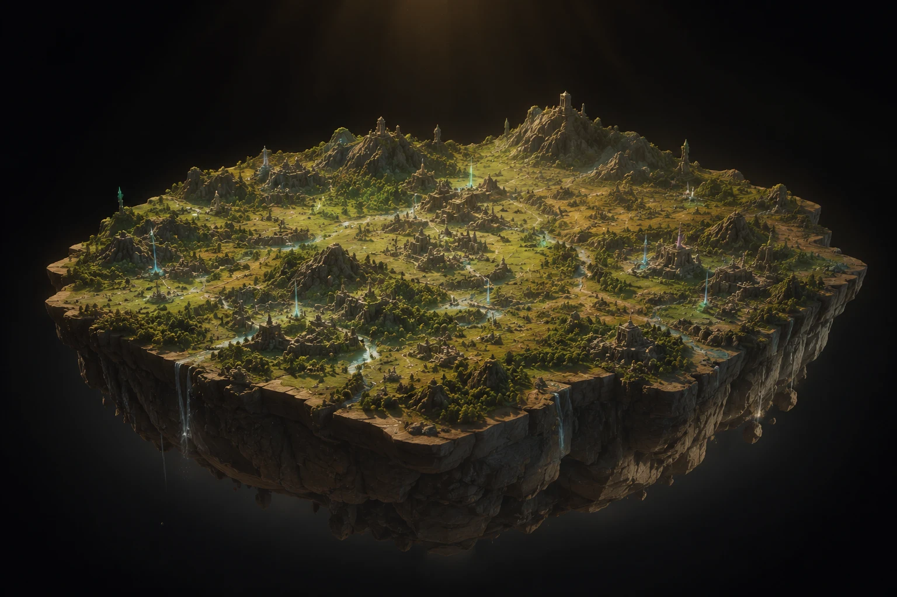
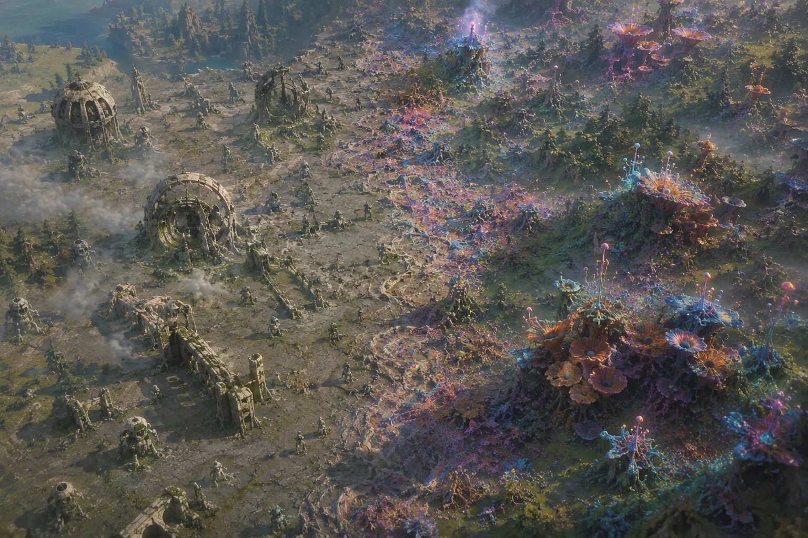
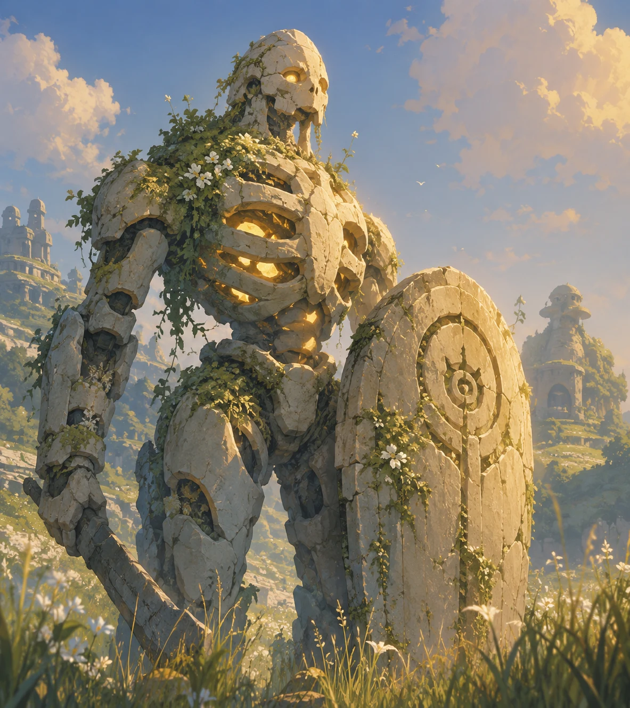
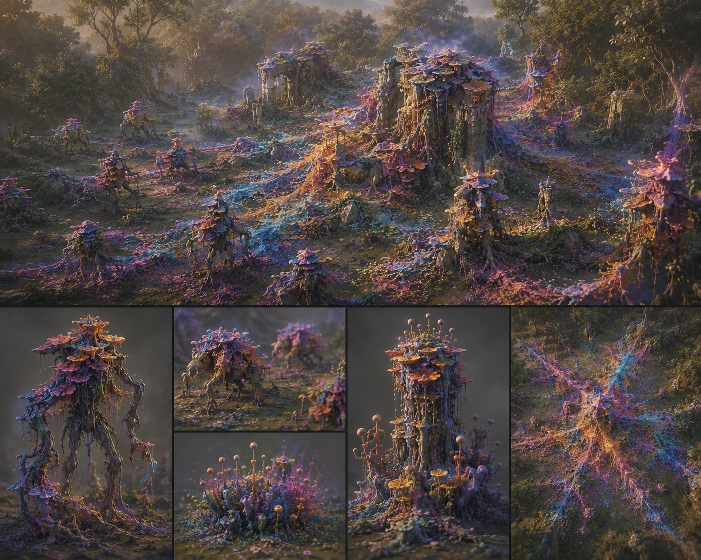
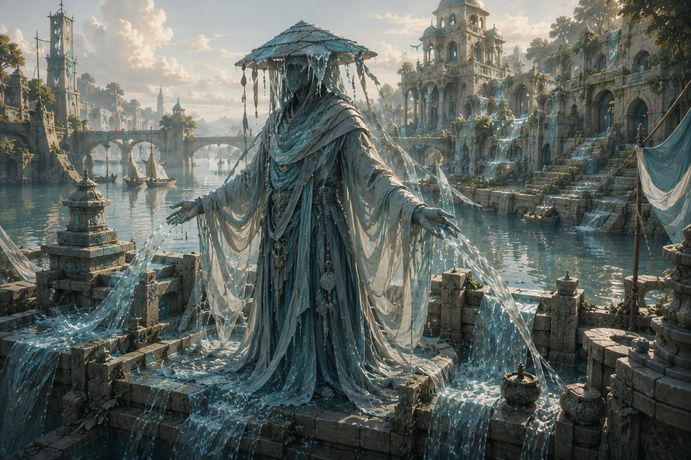

# Greenmantle

> **Greenmantle** is the project codename. *Cohort* is a race within the game —
> the two are deliberately separate, so the project has an identity that does
> not shift when the roster does.

A real-time strategy game built around **commanding intent** rather than
clicking fast. The player acts as an Operations Commander — issuing objectives
and doctrine to an army that executes them intelligently.




<p align="center">
  <em>The war table. The battlefield is a physical miniature suspended in a black
  void — the camera runs from inside the grass to the whole board at once.</em>
</p>



<p align="center">
  <em>Fossilized memory meets an aggressive tide of iridescent life.</em>
</p>

**It is a game engine first.** Greenmantle is the first game built on it, and the
engine is being extracted by building that game rather than designed in the
abstract — so `src/sim/` must not know the name of any unit, race, resource or
stealth rule a different RTS might want changed. Those are content declared in
`src/data/`, and `tests/architecture.test.ts` fails the build if they leak
inward. See [`docs/ENGINE_VISION.md`](docs/ENGINE_VISION.md).

Runs in the browser. No engine dependency, no framework — TypeScript, Three.js and Vite. Maps now use deterministic irregular polygon boundaries rather than a permanent square board.

The current build also enforces polygon-aware fog of war across the tactical map and full 3D battlefield: unseen rival forces disappear from presentation and cannot be targeted through hidden information, while replay/spectator modes can opt into omniscient vision.

An optional guided introduction is available from the in-game **Tutorial** button or by opening `/?tutorial=1`. It observes the live match state and teaches the core selection, economy, production, movement, and whole-board camera flow without changing deterministic simulation behavior.

## Visual direction

<table>
<tr>
<td width="33%"></td>
<td width="33%"></td>
<td width="33%"></td>
</tr>
<tr>
<td align="center"><b>Cohort</b><br>Fossilized legacy still carrying out its purpose.</td>
<td align="center"><b>Mycora</b><br>Beautiful life spreading with the violence of disease.</td>
<td align="center"><b>Conclave</b><br>Coordination embodied as water, fabric, and flow.</td>
</tr>
</table>

See the full [original concept-art gallery](docs/CONCEPT_ART.md).

## About the artwork

**All imagery in this repository and on the development site is concept art —
not in-game footage.** The pieces in `docs/assets/concept-art/` are AI-generated
explorations produced from the prompts in `docs/ART_PROMPTS.md`, and they exist
to pin down silhouette, material and faction identity before any of it is
modelled.

The game itself currently renders stylized placeholder geometry. Nothing in the
gallery has been built yet.

## Downloading a versioned copy

Use the **Releases** page, or any tag. A download taken from tag `v1.12.0`
extracts to `Greenmantle-1.12.0/`.

A download taken from a *branch* extracts to `Greenmantle-main/` instead —
GitHub names archives after the ref and a repository cannot override that. Those
downloads still carry their version internally: the `VERSION` file at the root
is stamped with the exact commit and date when the archive is built.

To check what you have:

```bash
cat VERSION                      # in an extracted archive
git describe --tags --always     # in a git checkout
```

Cutting a release:

```bash
# bump "version" in package.json first
npm run release:tag
git push origin v<version>
```

The tag is generated from `package.json`, so the tag, the in-game build
identifier and the package version cannot drift apart. It refuses to run on a
dirty tree, and refuses to move an existing tag.

## Quick start

```bash
npm install
npm run dev
```

## Scripts

| Command | What |
|---|---|
| `npm run dev` | Vite dev server |
| `npm test` | Vitest — full suite |
| `npm run typecheck` | `tsc --noEmit` |
| `npm run lint` | ESLint |
| `npm run build` | Typecheck + production build |

## Controls

Core orders: **A** attack-move, **P** patrol, **S** stop, **H** hold position.

| Key | Action |
|---|---|
| Tutorial button / `?tutorial=1` | Start the guided introduction |
| Drag / click | Select units |
| Right click | Move |
| `1`–`5` | Select squad |
| `Ctrl`+`1`–`5` | Form squad from selection |
| `Q` / `E` / `R` | Train worker / legionnaire / marksman |
| `B` | Place outpost (with a worker selected) |
| `G` | Select all gatherers |
| `Esc` | Cancel current mode |
| `T` | Toggle the slow-frame throttle (tick-rate independence test) |
| `Home` | Frame the entire battlefield |
| `` ` `` | Developer console (`/help` for commands) |

## Repository layout

```
src/
├── core/    types, seeded RNG, fixed-tick loop
├── data/    all balance numbers, no logic
├── sim/     deterministic headless simulation
├── render/  Three.js views
├── input/   mouse, keyboard, selection
└── ui/      HUD, chain editor, research panel, dev console
tests/       Vitest suites
docs/        design bible, architecture, decisions, state
legacy/      original HTML prototypes, kept for reference
```

**The one architectural rule:** `src/sim/` never imports from `render/`,
`input/` or `ui/`. The simulation is pure and deterministic — that is what makes
replays, lockstep multiplayer and a testable AI possible.
`tests/architecture.test.ts` enforces it.

## Documentation

Start at [`START_HERE.md`](START_HERE.md). The key documents:

| File | Purpose |
|---|---|
| [`CLAUDE.md`](CLAUDE.md) | Orientation + coding rules |
| [`docs/CURRENT_STATE.md`](docs/CURRENT_STATE.md) | What's done, in flight, next |
| [`docs/GAME_DESIGN.md`](docs/GAME_DESIGN.md) | Full design bible |
| [`docs/UI_BLUEPRINT.md`](docs/UI_BLUEPRINT.md) | Target command interface |
| [`docs/ARCHITECTURE.md`](docs/ARCHITECTURE.md) | Module map |
| [`docs/DECISIONS.md`](docs/DECISIONS.md) | Decision log |
| [`docs/ROADMAP.md`](docs/ROADMAP.md) | Phase plan |
| [`docs/CONCEPT_ART.md`](docs/CONCEPT_ART.md) | First-party visual targets and implementation notes |


## Open RTS engine vision

Greenmantle is intended to remain open source and gradually become a reusable,
browser-first RTS foundation. The long-term goal is to let creators define their
own armies, factions, resources, lore, balance, scenarios, and presentation while
reusing the deterministic simulation, commands, replay foundation, renderer,
testing tools, and public development site. Development remains game-first: the
engine is extracted from systems proven in Greenmantle rather than designed in the
abstract. See [`docs/ENGINE_VISION.md`](docs/ENGINE_VISION.md).

## The world beneath the war table


Greenmantle is staged in a black void. At ordinary play distance the battlefield
reads as a physical miniature war table; at maximum zoom the complete board will
resolve into a monumental **World Turtle** carrying the terrain on its back. The
current descending terrain edges are a temporary production scaffold for that
future silhouette.

The camera is not a conventional RTS camera bolted onto a landscape: it is a free
orbital view over a table, with a zoom range from miniature (down among the units)
to cosmological (the whole board as an object). That range is why level-of-detail
is load-bearing rather than an optimisation, and why art is authored against the
table rather than against a fixed top-down angle (D-014, D-026).


## Future map shapes

Production maps are planned as deterministic procedural polygons rather than permanently square boards. The canonical boundary will drive terrain, navigation, placement, camera framing, minimaps, fog, descending edges, and the World Turtle silhouette. See `docs/MAP_GENERATION.md`.

### Polygon-safe gameplay

The seeded battlefield boundary now governs starting layouts, resource placement, issued orders, rallies, production exits, and unit movement—not only the rendered terrain.


### Latest development milestone

The current build includes a polygon-aware tactical map with live unit, structure, resource, and camera markers. It uses the same seeded boundary as the battlefield, supports click-and-drag camera navigation, tracks unexplored/explored/currently visible space, filters unseen rival information, and provides exact or random map-seed loading.

### Live development roadmap

The public page at `/development.html` displays the **complete** canonical roadmap,
not a hand-written summary. `npm run sync:site` publishes `docs/PROGRESS.md` and
`docs/ROADMAP.md`; the same synchronization runs automatically before development
and production builds.
