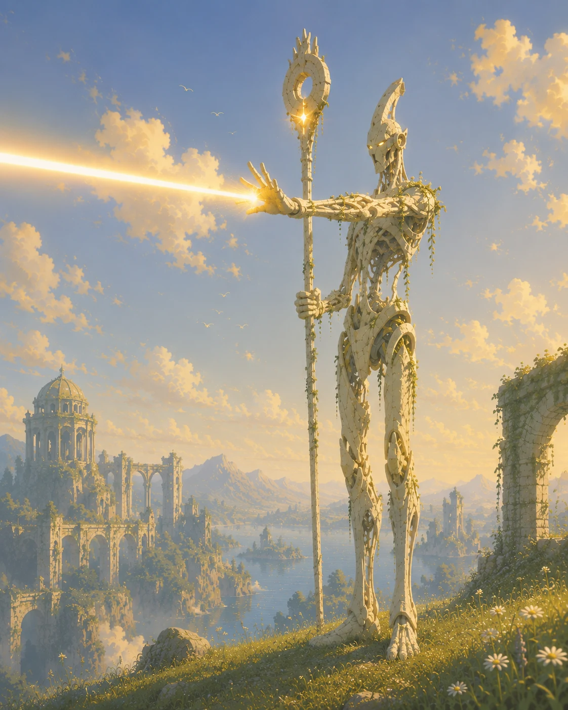
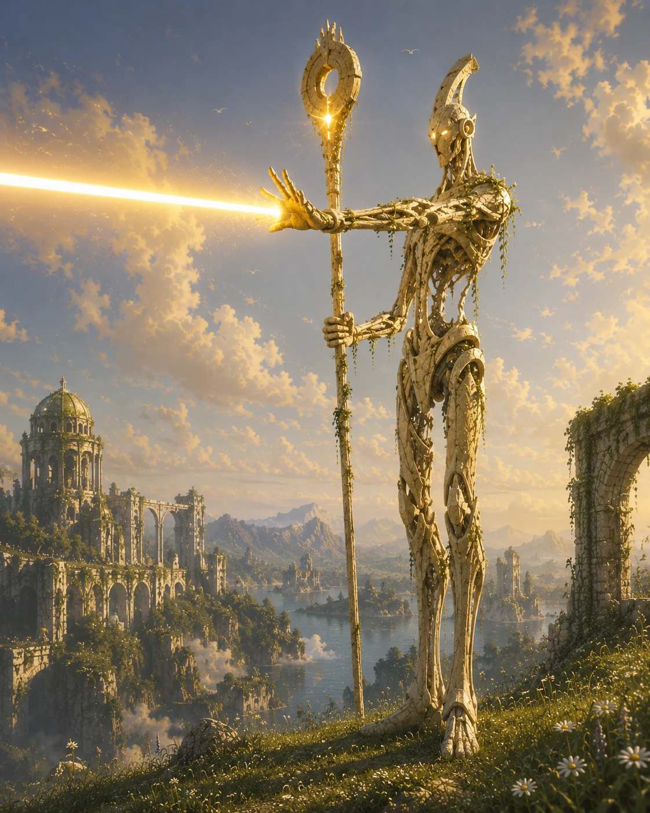
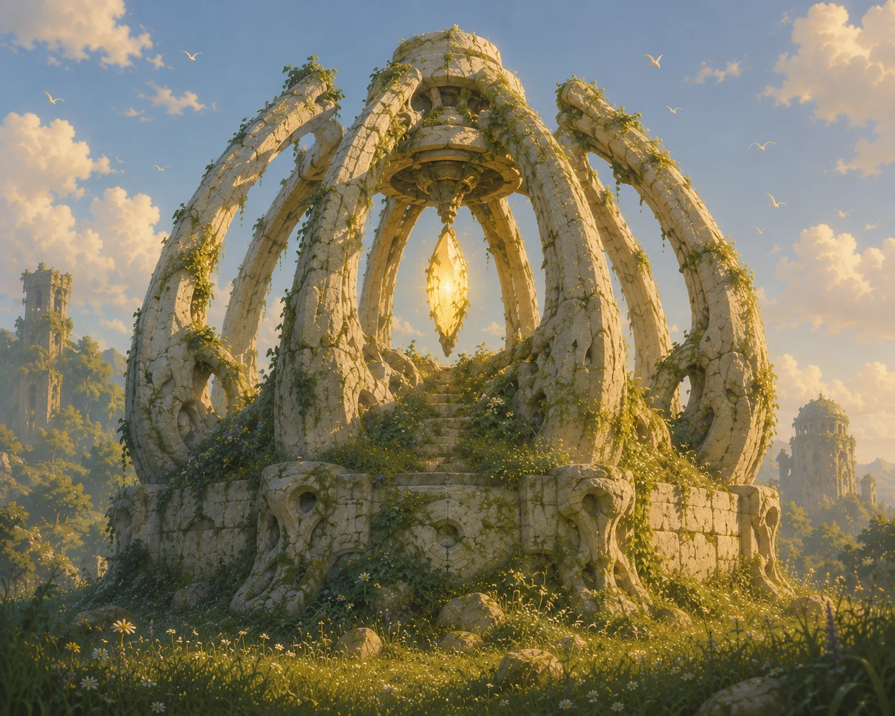
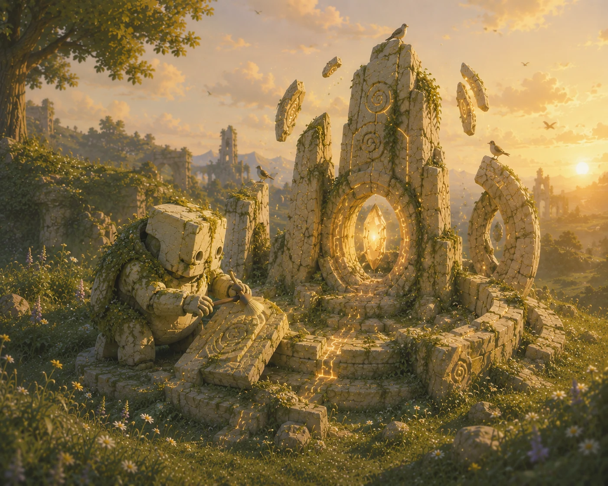
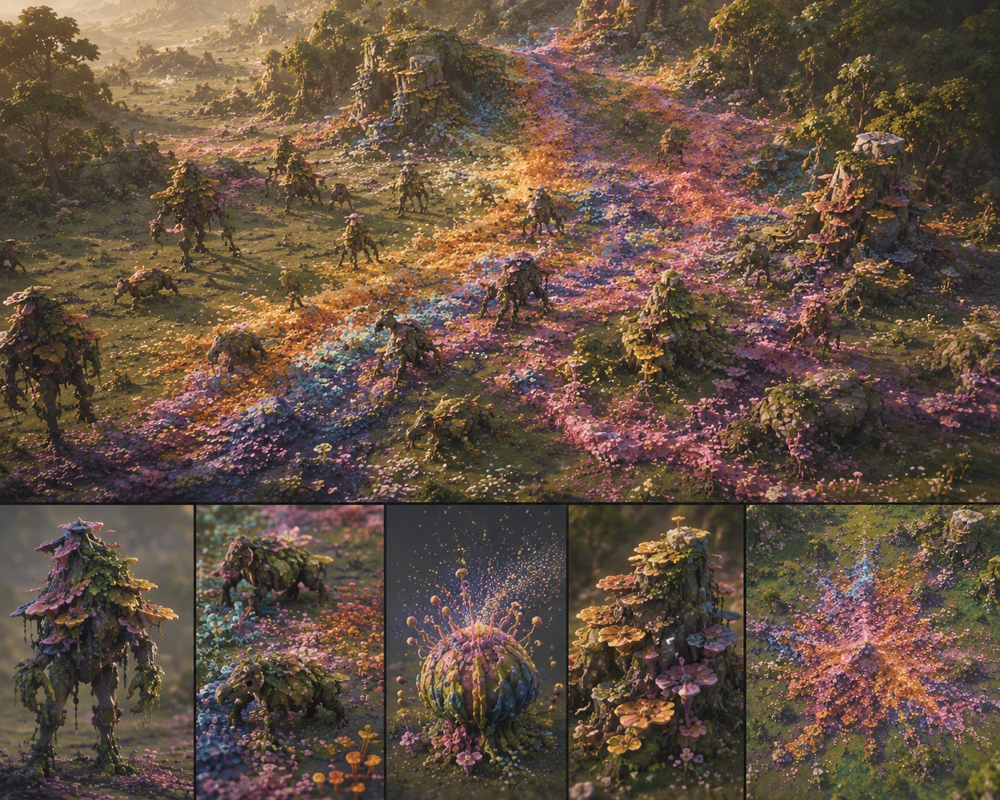
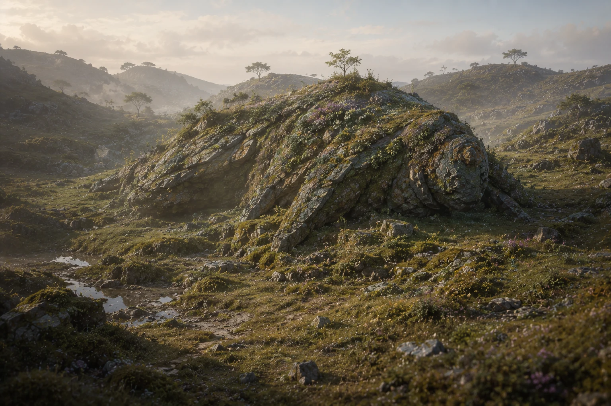

# Original Concept Art

These images are the project's first-party visual targets. They are **directional
references**, not promises that the shipping game will reproduce hero-shot detail
at RTS scale. Every asset and effect must still satisfy the war-table camera,
unit readability, and performance constraints in `DECISIONS.md` D-005/D-006.

The repository copies are WebP derivatives optimized for GitHub and project
handoffs. The uploaded source images remain the visual masters outside the repo.

## Battlefield identity

The central visual thesis: **two forces of nature fighting over literal ground**.
Cohort territory is pale, fossilized, architectural, and exhausted; Mycora
territory is an aggressive burst of fungal, floral, mossy, iridescent life.
The boundary must remain readable from the gameplay camera and should eventually
communicate vision, domain, and faction pressure—not merely decorate terrain.

## War-table camera

This is the macro presentation target: a battlefield that reads as a tangible,
miniature mythic world. It supports the current camera work, strategic zoom,
strong silhouettes, layered terrain, and selective emissive landmarks.

## Cohort

<table>
<tr>
<td width="50%"></td>
<td width="50%"></td>
</tr>
<tr>
<td><b>Legionnaire.</b> Monumental fossil-stone defender; shield-first silhouette, warm internal light, ancient civilization continuing after its makers are gone.</td>
<td><b>Marksman.</b> Upright one-handed staff; the attack is literal light. Preserve the elegant vertical pose and avoid a conventional rifle silhouette.</td>
</tr>
</table>

The image above is explicitly a **hero-material/detail reference**, not the final
in-game rendering target. Its realism must be translated into the project's
stylized, low-ish-poly, painterly language.

<table>
<tr>
<td width="50%"></td>
<td width="50%"></td>
</tr>
<tr>
<td><b>Standard / main base.</b> Fossilized architecture, repeating arches, an exposed warm core, and no readable industrial machinery.</td>
<td><b>Worker / caretaker.</b> Gentle restoration rather than mining. The act should read as recovering understanding from what a past civilization left behind.</td>
</tr>
</table>

## Conclave

Conclave should feel almost made of **water and fabric**: flowing layered
silhouettes, translucent surfaces, canal architecture, and motion that resembles
currents rather than mechanical articulation. This is a close concept target;
RTS-scale versions need simplified flow and controlled transparency.

## Mycora

<table>
<tr>
<td width="50%"></td>
<td width="50%"></td>
</tr>
<tr>
<td><b>Structures and organism language.</b> Colonies, fungal towers, flowering masses, dangling roots, and units that appear locally distinct but belong to one body.</td>
<td><b>Macro spread.</b> A tidal infection of life. Death leaves stains of moss, fungus, and flowers that can provide vision/domain and make the army feel continuous like water.</td>
</tr>
</table>

Mycora is the aggressive swarm faction, but must never default to insectoid,
chitinous, or conventional Zerg imagery. The horror comes from life thriving too
successfully: beautiful, cancerous, iridescent, and indifferent.

## Titanfolk

Titanfolk should blur landscape and creature. At rest, a body may read as a
mossy hill or geological mass; when it moves, the terrain itself appears to wake.
This supports very large silhouettes and low-frequency animation rather than
constant busy motion.

## Implementation use

Use these images when reviewing:

- silhouette at strategic, normal, and inspection zoom;
- faction material palettes and hue-shifted lighting;
- structure kits and environmental language;
- contested-ground prototypes;
- LOD decisions and which details survive the actual camera;
- concept-art prompts and future external asset briefs.

Do not use them as justification for uncontrolled polygon counts, expensive
full-screen effects, excessive transparency, or visual noise that compromises
selection and command clarity.
