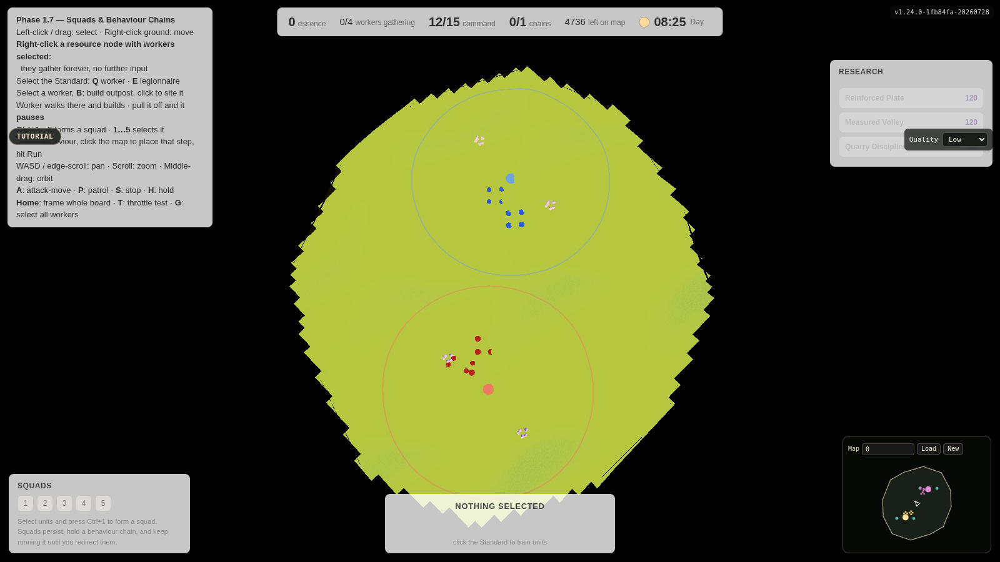
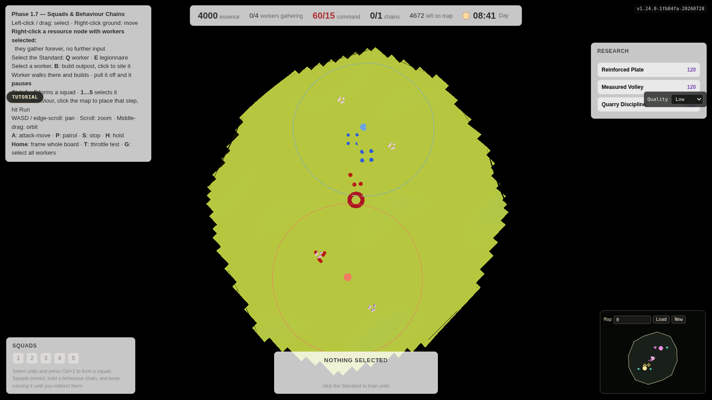
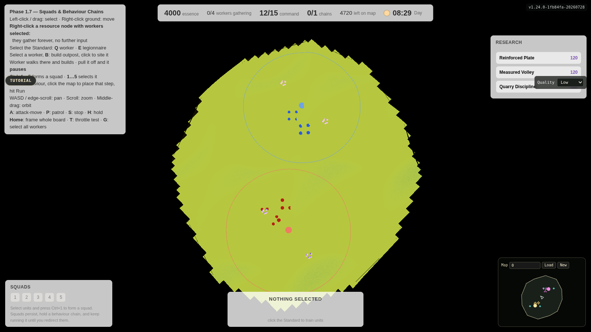
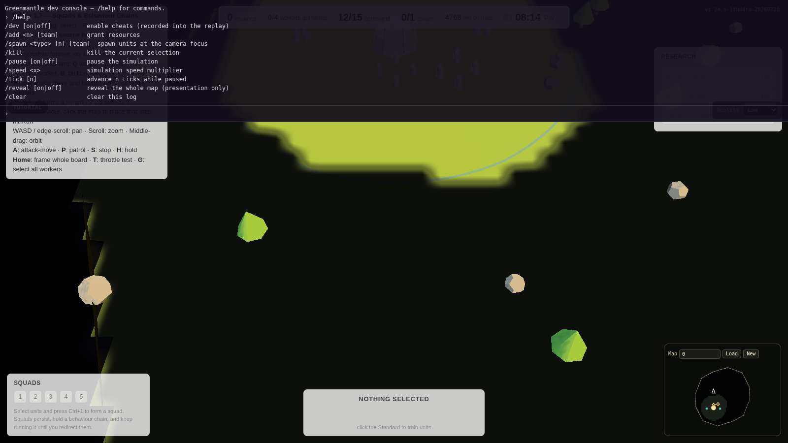

# Development screenshots

**These are real in-game captures, not concept art.** Everything on this page is
the actual build rendering actual simulation state — which is exactly why it is
worth being blunt: *the game does not look good yet.* The concept art in
[`CONCEPT_ART.md`](CONCEPT_ART.md) is the target; this page is the honest
distance still to travel.

Captured at v1.24.0 on 1600×900.

> **Caveat on fidelity.** These were taken in a headless container with no GPU,
> so Chromium fell back to software rendering (SwiftShader) and the quality
> tier auto-detected to **Low**. Shadows, higher mesh subdivision and the full
> painterly response are absent. On real hardware at High the shading model is
> considerably warmer than this — but the *composition* problems visible here
> are real and not a rendering artefact.

---

## The war table, whole board

`Home` frames the entire play area. The polygon boundary, both bases, their
control rings and the resource nodes are all visible; map revealed via the dev
console. At this distance the level-of-detail system deliberately swaps unit
meshes for strategic markers (D-014) — the dots are the LOD working, not units
failing to render.

**What this shot says about the work left:** terrain reads as one flat green
mass. There is no height legibility, no material variation, and nothing that
tells you where high ground or a chokepoint is. D-035 says maps must be
*arcade-legible*; this is the evidence that generation, not shading, is the
blocker.

## Contact

48 units spawned through the dev console and left to fight. Command shows
`60/15` — over cap, because cheats do not respect supply — and the research
panel has lit up now that 4000 is banked. The two forces have met at the
midpoint between the control rings.

## Research

The tech track (D-028), reachable in-game. Rows grey out when unaffordable and
light the moment they are payable. Doctrine pairs state explicitly that taking
one does not forfeit the other — that reassurance is the mechanic.

## Developer console

Backtick opens it. Every shot on this page was staged through it. Cheats are
recorded into the replay stream as ordinary commands and gated on hashed
`devMode`, so a session staged this way still replays exactly — and a clean
competitive match can prove no cheat was ever enabled.

---

## Where this is going

The gap between these captures and the concept art is the subject of the
**visual overhaul** queued in [`TODO.md`](TODO.md). In short: the painterly
shading model is in place and correct, but almost nothing else that makes a
scene read well has been built — silhouette variety, ground material variation,
readable elevation, contact shadows, and any sense of depth in the void.
